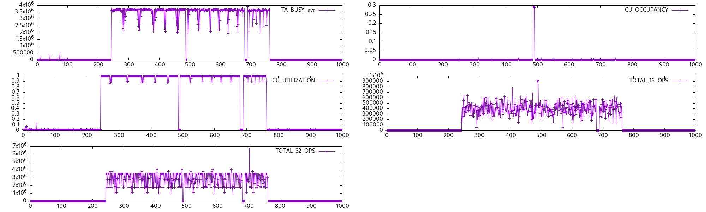

# Rocprofiler example

NOTE: this runs in a very tight loop and is not representative of the real load.

## Build and run

```bash
make
./standalone_v1_poll
```

## Run load

Make sure to run this before starting the load in a different terminal:

(you don't need this for TA_BUSY_avr)

```bash
export HSA_TOOLS_LIB=/opt/rocm/lib/librocprofiler64.so.1
```

For load I recommend [gpu-burn](https://github.com/ROCm/HIP-Examples/tree/master/gpu-burn)

## Plots


